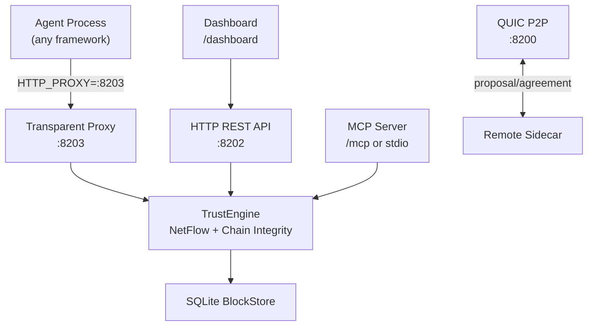

# TrustChain

[](https://github.com/viftode4/trustchain/actions)
[](LICENSE)

**Decentralized trust infrastructure for the AI agent economy.**

TrustChain is a universal trust primitive — a bilateral signed ledger where every agent-to-agent interaction produces cryptographic proof. Trust scores emerge from real interaction history, not ratings or reputation systems. Sybil attacks fail because fake identities have no legitimate transaction graph to exploit.

Built on the [TrustChain protocol](https://doi.org/10.1016/j.future.2020.01.031) (Otte, de Vos, Pouwelse — TU Delft), extended with NetFlow trust computation for AI agent economies.

## Quick Start

### For Python agents (easiest)

```bash
pip install trustchain-py
```

```python
from trustchain import with_trust

@with_trust(name="my-agent")
def main():
    # All HTTP calls are now trust-protected. Binary downloads automatically.
    ...

main()
```

### Install the binary directly

Download from [GitHub Releases](https://github.com/viftode4/trustchain/releases), or:

```bash
cargo install trustchain-node
```

### Run as a sidecar

```bash
# Generates identity, starts all services, prints HTTP_PROXY
trustchain-node sidecar --name my-agent --endpoint http://localhost:8080

# Then in your agent:
export HTTP_PROXY=http://127.0.0.1:8203
python my_agent.py   # all outbound HTTP calls are now trust-protected
```

### Launch wrapper (Dapr-style)

```bash
trustchain-node launch --name my-agent -- python my_agent.py
```

## Key Features

- **Transparent sidecar proxy** — agents set `HTTP_PROXY` once; trust is handled invisibly
- **Ed25519 identity** — self-sovereign keypairs, auto-generated on first run
- **Bilateral half-block chain** — each party signs only their own block; no coordinator
- **NetFlow Sybil resistance** — max-flow from seed nodes; fake identities can't manufacture trust
- **QUIC P2P transport** — TLS 1.3 mutual auth, STUN NAT traversal
- **Live dashboard** — embedded HTML dashboard at `GET /dashboard`
- **Trust headers** — `X-TrustChain-Score`, `X-TrustChain-Pubkey` injected into proxied responses
- **SQLite storage** — WAL mode, survives restarts
- **Delegation protocol** — identity succession and capability delegation with revocation
- **MCP server** — expose trust tools to Claude Desktop, Cursor, VS Code Copilot
- **296 tests** across the workspace

## Architecture



### Crate Structure

| Crate | Description |
|-------|-------------|
| [`trustchain-core`](trustchain-core/) | Identity, half-blocks, block storage, trust engine, NetFlow, CHECO consensus, delegation |
| [`trustchain-transport`](trustchain-transport/) | QUIC P2P, HTTP REST, transparent proxy, dashboard, peer discovery, MCP server |
| [`trustchain-node`](trustchain-node/) | CLI binary — sidecar, launch wrapper, keygen, MCP stdio |
| [`trustchain-wasm`](trustchain-wasm/) | WASM bindings for browser/edge (experimental) |

## Default Ports

| Port | Protocol | Purpose |
|------|----------|---------|
| 8200 | QUIC/UDP | P2P transport |
| 8202 | HTTP/TCP | REST API + dashboard + MCP |
| 8203 | HTTP/TCP | Transparent proxy |

All ports shift with `--port-base`.

## HTTP API

| Method | Path | Description |
|--------|------|-------------|
| `GET` | `/healthz` | Liveness probe |
| `GET` | `/status` | Node status: pubkey, chain length, peer count |
| `GET` | `/dashboard` | Live trust dashboard (embedded HTML) |
| `GET` | `/metrics` | Prometheus metrics |
| `GET` | `/trust/{pubkey}` | Trust score (0.0–1.0) |
| `POST` | `/propose` | Initiate bilateral interaction |
| `GET` | `/peers` | List known peers |
| `GET` | `/discover` | Discover peers by capability |
| `POST` | `/delegate` | Create delegation |
| `POST` | `/revoke` | Revoke delegation |

## Trust Scoring

| Component | Weight | What it measures |
|-----------|--------|-----------------|
| **Chain Integrity** | 30% | Hash links, sequence continuity, Ed25519 signatures |
| **NetFlow** | 40% | Max-flow from seed nodes — Sybil resistance |
| **Statistical** | 30% | Volume, completion rate, diversity, age |

Proven fraud → permanent hard-zero trust score.

## Protocol

Based on [IETF draft-pouwelse-trustchain](https://datatracker.ietf.org/doc/draft-pouwelse-trustchain/):

```
Alice's chain:              Bob's chain:
┌──────────────┐            ┌──────────────┐
│ PROPOSAL     │──────────► │ AGREEMENT    │
│ seq=2, sig=A │ ◄───────── │ seq=2, sig=B │
└──────────────┘            └──────────────┘
       ▲                           ▲
┌──────────────┐            ┌──────────────┐
│ PROPOSAL     │──────────► │ AGREEMENT    │
│ seq=1, sig=A │ ◄───────── │ seq=1, sig=B │
└──────────────┘            └──────────────┘
```

## Building from Source

```bash
git clone https://github.com/viftode4/trustchain.git
cd trustchain
cargo build --release
cargo test --workspace   # 296 tests
```

## Research

**Core paper**: Otte, de Vos, Pouwelse — [TrustChain: A Sybil-resistant scalable blockchain](https://doi.org/10.1016/j.future.2020.01.031) (Future Generation Computer Systems, 2020)

## Related Projects

- [trustchain-py](https://github.com/viftode4/trustchain-py) — Python SDK: `pip install trustchain-py`, `@with_trust` decorator
- [trustchain-js](https://github.com/viftode4/trustchain-js) — TypeScript SDK
- [trustchain-agent-os](https://github.com/viftode4/trustchain-agent-os) — Agent framework adapters (12 frameworks)

## License

MIT
