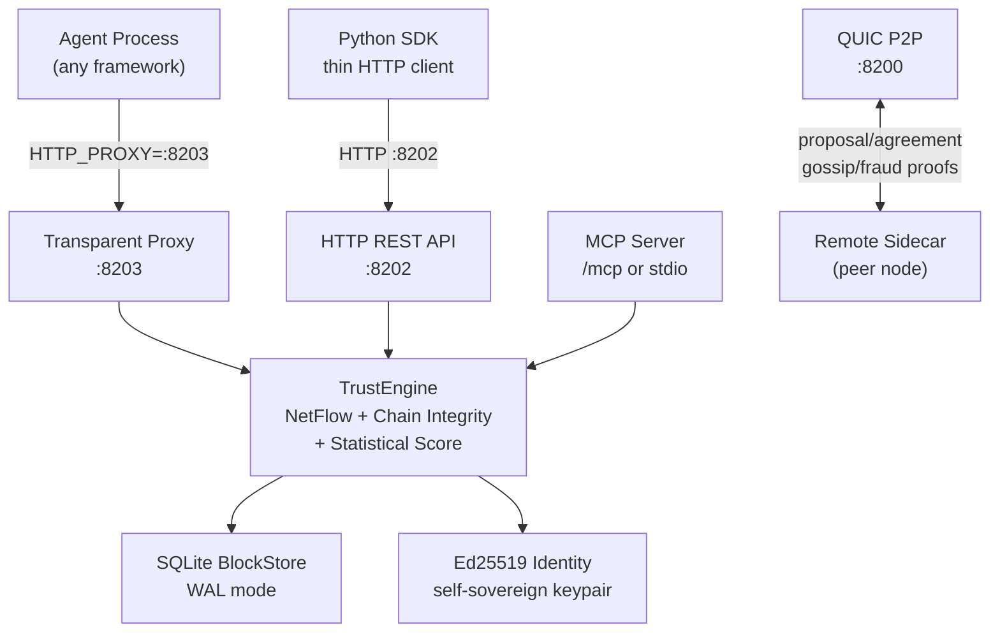

# TrustChain

[](https://github.com/levvlad/trustchain/actions)
[](https://crates.io/crates/trustchain-node)
[](LICENSE)

**Decentralized trust infrastructure for the AI agent economy.**

TrustChain is a universal trust primitive — a bilateral signed ledger where every agent-to-agent interaction produces cryptographic proof. Every call creates two half-blocks, independently signed by each party, forming an append-only chain per agent. Trust scores emerge from real interaction history, not ratings or reputation systems. Sybil attacks fail because fake identities have no legitimate transaction graph to exploit.

Built on the [TrustChain protocol](https://doi.org/10.1016/j.future.2020.01.031) (Otte, de Vos, Pouwelse — TU Delft Distributed Systems Group), extended for AI agent economies.

## Key Features

- **Transparent sidecar proxy** — agents set `HTTP_PROXY=http://127.0.0.1:8203` once; trust is handled invisibly at the infrastructure layer
- **Ed25519 identity** — self-sovereign keypairs, persistent across restarts, auto-generated on first run
- **Bilateral half-block chain** — each party signs only their own block; no shared state, no coordinator
- **NetFlow Sybil resistance** — max-flow graph analysis from seed nodes; fake identities cannot manufacture trust paths
- **QUIC P2P transport** — TLS 1.3 mutual auth, connection reuse, rate limiting, STUN NAT traversal
- **SQLite storage** — WAL mode, peer persistence, survives restarts
- **CHECO consensus** — periodic checkpoint blocks for finality, facilitator rotation
- **Fraud detection** — double-sign and double-countersign detection; proven fraudsters receive permanent hard-zero trust
- **Delegation protocol** — identity succession and capability delegation with revocation
- **MCP server** — expose trust primitives as tools to Claude Desktop, Cursor, VS Code Copilot
- **181 tests** across the workspace

## Architecture



### Crate Structure

```
trustchain-core          Identity · HalfBlock · BlockStore · Protocol
                         TrustEngine · NetFlow · CHECO · Crawler · Delegation
       |
trustchain-transport     QUIC · gRPC · HTTP REST · Transparent Proxy
                         Peer Discovery · Gossip · MCP Server · STUN
       |
trustchain-node          CLI binary: run / sidecar / launch / keygen / mcp-stdio
       |
trustchain-wasm          WASM bindings for browser/edge (experimental)
```

| Crate | Description |
|-------|-------------|
| [`trustchain-core`](trustchain-core/) | Protocol layer — no networking. Identity (Ed25519), half-blocks, block storage, trust engine, NetFlow Sybil resistance, CHECO consensus, chain crawler, delegation protocol |
| [`trustchain-transport`](trustchain-transport/) | QUIC P2P, gRPC, HTTP REST, transparent proxy, peer discovery, gossip, MCP server, STUN NAT traversal |
| [`trustchain-node`](trustchain-node/) | CLI binary — standalone node, sidecar proxy, MCP stdio, `launch` (Dapr-style wrapper) |
| [`trustchain-wasm`](trustchain-wasm/) | WASM bindings for browser and edge deployments (experimental) |

## Quick Start

### Install the binary

```bash
cargo install trustchain-node
```

Or download a pre-built binary from [GitHub Releases](https://github.com/levvlad/trustchain/releases).

### Run as a sidecar (recommended)

```bash
# One command: generates identity, starts all services, prints HTTP_PROXY
trustchain-node sidecar \
  --name my-agent \
  --endpoint http://localhost:8080

# Then in your agent process:
export HTTP_PROXY=http://127.0.0.1:8203
python my_agent.py   # all outbound HTTP calls are now trust-protected
```

### Launch wrapper (Dapr-style)

```bash
# Starts sidecar, waits for /healthz, sets HTTP_PROXY, then runs your app.
# Sidecar shuts down automatically when the app exits.
trustchain-node launch --name my-agent -- python my_agent.py
```

### Generate a keypair

```bash
trustchain-node keygen --output identity.key
```

### Run a full node

```bash
trustchain-node run --config node.toml
```

### MCP stdio (Claude Desktop / Cursor)

```bash
trustchain-node mcp-stdio --name my-agent
```

## Building from Source

```bash
git clone https://github.com/levvlad/trustchain.git
cd trustchain
cargo build --release
# Binary: target/release/trustchain-node
```

### Run tests

```bash
cargo test --workspace
cargo test --workspace --features mcp   # includes MCP server tests
```

### Docker

```bash
docker build -t trustchain .
docker run -d \
  -p 8200:8200 -p 8202:8202 -p 50051:50051 \
  -v trustchain-data:/data \
  trustchain
```

### systemd

```bash
sudo cp deploy/trustchain.service /etc/systemd/system/
sudo systemctl enable --now trustchain
```

## Default Ports

| Port | Protocol | Purpose |
|------|----------|---------|
| 8200 | QUIC/UDP | P2P transport (proposal/agreement, gossip, fraud proofs) |
| 8201 | gRPC/TCP | Protobuf-native agent API |
| 8202 | HTTP/TCP | REST API + MCP server (`/mcp`) |
| 8203 | HTTP/TCP | Transparent proxy (set as `HTTP_PROXY`) |

All ports are derived from `--port-base` (default 8200). Pass `--port-base 9200` to shift all four.

## HTTP API Reference

All endpoints are on the HTTP REST API (`http://localhost:8202` by default).

### Node status

| Method | Path | Description |
|--------|------|-------------|
| `GET` | `/healthz` | Liveness probe — returns `{"status":"ok"}` |
| `GET` | `/status` | Node status: pubkey, chain length, block count, peer count |
| `GET` | `/metrics` | Prometheus-compatible metrics |

### Trust protocol

| Method | Path | Description |
|--------|------|-------------|
| `POST` | `/propose` | Initiate a trust interaction with a counterparty |
| `POST` | `/receive_proposal` | Receive an inbound proposal from a remote node |
| `POST` | `/receive_agreement` | Receive an inbound agreement from a remote node |
| `GET` | `/trust/{pubkey}` | Compute trust score (0.0–1.0) for a peer |

### Chain & blocks

| Method | Path | Description |
|--------|------|-------------|
| `GET` | `/chain/{pubkey}` | Retrieve all blocks in a peer's chain |
| `GET` | `/block/{pubkey}/{seq}` | Retrieve a single block by pubkey and sequence number |
| `GET` | `/crawl/{pubkey}` | Crawl the interaction graph starting from a pubkey |

### Peers & discovery

| Method | Path | Description |
|--------|------|-------------|
| `GET` | `/peers` | List all known peers |
| `POST` | `/peers` | Register a new peer |
| `GET` | `/discover` | Discover peers by capability and minimum trust score |

### Identity & delegation

| Method | Path | Description |
|--------|------|-------------|
| `GET` | `/identity/{pubkey}` | Resolve a public key to identity metadata |
| `POST` | `/delegate` | Create a delegation record |
| `POST` | `/revoke` | Revoke a delegation |
| `GET` | `/delegations/{pubkey}` | List all delegations for a pubkey |
| `GET` | `/delegation/{id}` | Retrieve a specific delegation by ID |

### MCP server

The MCP server is mounted at `/mcp` on the same HTTP port. Five tools are exposed:

| Tool | Description |
|------|-------------|
| `trustchain_check_trust` | Compute overall trust score plus component breakdown (chain integrity, NetFlow, statistical) |
| `trustchain_discover_peers` | List known peers ranked by trust score, with optional min-trust filter |
| `trustchain_record_interaction` | Create a proposal block to initiate a bilateral interaction record |
| `trustchain_get_identity` | Return this node's public key, chain length, block count, and peer count |
| `trustchain_verify_chain` | Verify hash links, signatures, and sequence continuity for a peer's chain |

For local LLM hosts, use `trustchain-node mcp-stdio` instead and configure it as a stdio transport in Claude Desktop or Cursor.

## Trust Scoring

`TrustEngine` computes a weighted three-component score for any peer pubkey:

| Component | Weight | What it measures |
|-----------|--------|-----------------|
| **Chain Integrity** | 30% | Hash links valid, no sequence gaps, all Ed25519 signatures verify |
| **NetFlow** | 40% | Max-flow from seed nodes through the interaction graph — primary Sybil resistance |
| **Statistical** | 30% | Interaction volume, completion rate, counterparty diversity, account age, entropy |

Peers with proven double-spend fraud receive a **permanent hard-zero** trust score — no recovery path.

## Protocol

Based on [IETF draft-pouwelse-trustchain](https://datatracker.ietf.org/doc/draft-pouwelse-trustchain/):

1. **Half-block model** — each agent creates and signs only their own block; there is no shared state
2. **Proposal/Agreement flow** — A sends `(seq, link_to_B, transaction, sig_A)`; B validates, creates the agreement block linking back, returns `(seq, link_to_A, sig_B)`; both parties store both blocks
3. **Hash-linked chains** — every block references the previous block's hash; gaps and forks are detectable
4. **Ed25519 signatures** — every block is signed exclusively by its creator; non-repudiable

```
Alice's chain:              Bob's chain:
┌──────────────┐            ┌──────────────┐
│ PROPOSAL     │──────────► │ AGREEMENT    │
│ seq=2        │ ◄───────── │ seq=2        │
│ sig=Alice    │            │ sig=Bob      │
│ prev=hash1   │            │ prev=hash1   │
└──────────────┘            └──────────────┘
       ▲                           ▲
   prev_hash                   prev_hash
       ▲                           ▲
┌──────────────┐            ┌──────────────┐
│ PROPOSAL     │──────────► │ AGREEMENT    │
│ seq=1        │ ◄───────── │ seq=1        │
│ sig=Alice    │            │ sig=Bob      │
└──────────────┘            └──────────────┘
```

## Library Usage

```toml
# Cargo.toml
[dependencies]
trustchain-core = "0.1"
trustchain-transport = "0.1"
```

```rust
use trustchain_core::{Identity, MemoryBlockStore, TrustChainProtocol};

// Generate identity
let identity = Identity::generate();

// Create protocol instance
let store = MemoryBlockStore::new();
let mut protocol = TrustChainProtocol::new(identity, store);

// Propose an interaction with a counterparty
let counterparty_pubkey = "abc123...";
let transaction = serde_json::json!({"type": "service", "outcome": "success"});
let proposal = protocol.create_proposal(counterparty_pubkey, transaction, None)?;

println!("Proposal block: seq={}, hash={}", proposal.sequence_number, proposal.block_hash);
```

## Research Foundation

**Core paper**: Otte, de Vos, Pouwelse — [TrustChain: A Sybil-resistant scalable blockchain](https://doi.org/10.1016/j.future.2020.01.031) (Future Generation Computer Systems, 2020)

Key contributions realized in this implementation:
- **Half-block architecture** (Section 3.1) — each party signs only their own block
- **NetFlow-based Sybil resistance** (Section 4) — trust computed via max-flow from seed nodes
- **Scalability through bilateral accountability** — linear scaling, no miners, no gas fees

Extension for AI agents: transparent sidecar model, trust-gated services, MCP gateway integration, framework adapters, QUIC P2P + gRPC + HTTP transport stack.

## References

- Otte, de Vos, Pouwelse — [TrustChain: A Sybil-resistant scalable blockchain](https://doi.org/10.1016/j.future.2020.01.031) (Future Generation Computer Systems, 2020)
- [IETF draft-pouwelse-trustchain-01](https://datatracker.ietf.org/doc/draft-pouwelse-trustchain/) — Protocol specification
- [py-ipv8](https://github.com/Tribler/py-ipv8) — TU Delft reference implementation (Python)
- [kotlin-ipv8](https://github.com/Tribler/kotlin-ipv8) — Mobile implementation (Kotlin/Android)

## Related Projects

- [trustchain-sdk](https://github.com/levvlad/trustchain-sdk) — Python SDK: zero-config `trustchain.init()`, full protocol bindings, QUIC/gRPC extras
- [trustchain-agent-os](https://github.com/levvlad/trustchain-agent-os) — Agent framework adapters for LangGraph, CrewAI, AutoGen, OpenAI Agents, Google ADK, ElizaOS

## License

MIT
