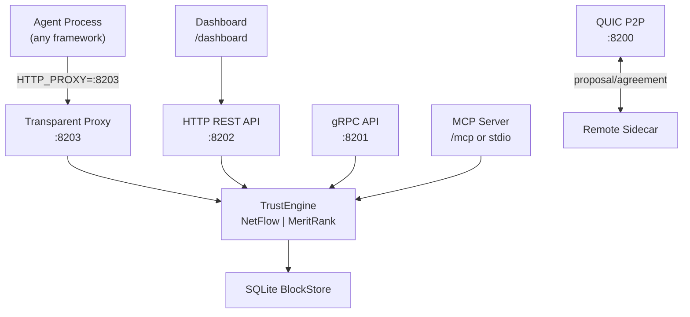

# TrustChain

[](https://github.com/viftode4/trustchain/actions)
[](LICENSE)

**Interaction-record and coordination layer for autonomous agents and agent networks.**

Agent communication, identity, authorization, and payment rails are arriving fast. The missing layer is what actually happened between autonomous parties once they start delegating work, calling tools, and transacting across frameworks and platforms.

TrustChain gives agents portable identity, bilateral signed interaction history, delegation evidence, and trust-weighted coordination primitives. Trust scores emerge from that shared history, but the same substrate also powers discovery, routing, audit, disputes, and risk-aware decisions.

Built on the [TrustChain protocol](https://doi.org/10.1016/j.future.2017.08.048) (Otte, de Vos, Pouwelse — TU Delft), extended with pluggable trust computation (NetFlow max-flow + MeritRank random walks) and an [IETF Internet-Draft](https://datatracker.ietf.org/doc/draft-viftode-trustchain-trust/) for agent economies.

## Vision

TrustChain aims to become the base interaction-record and coordination layer for autonomous agents and agent networks. The primitive is portable identity plus bilateral signed interaction history. Trust is one major application over that history, but the same substrate also powers delegation, audit, disputes, and trust-weighted discovery/routing.

This repository is the authoritative Rust implementation of that substrate: the node, sidecar, transparent proxy, transport stack, delegation protocol, and trust engine.

## Quick Start

### For Python agents (easiest)

```bash
pip install trustchain-py
```

```python
from trustchain import with_trust

@with_trust(name="my-agent")
def main():
    # All HTTP calls are now trust-protected. Binary downloads automatically.
    ...

main()
```

### Install the binary directly

Download prebuilt binaries (Linux, macOS, Windows) from [GitHub Releases](https://github.com/viftode4/trustchain/releases).

### Run as a sidecar

```bash
# Generates identity, starts all services, prints HTTP_PROXY
trustchain-node sidecar --name my-agent --endpoint http://localhost:8080

# Then in your agent:
export HTTP_PROXY=http://127.0.0.1:8203
python my_agent.py   # all outbound HTTP calls are now trust-protected
```

### Launch wrapper (Dapr-style)

```bash
trustchain-node launch --name my-agent -- python my_agent.py
```

## Key Features

- **Transparent sidecar proxy** — agents set `HTTP_PROXY` once; trust is handled invisibly
- **Ed25519 identity** — self-sovereign keypairs, auto-generated on first run
- **Bilateral half-block chain** — each party signs only their own block; no coordinator
- **Single-player audit mode** — cryptographic audit log without a network; every tool call recorded as a self-signed audit block (agent black box recorder)
- **Pluggable Sybil resistance** — MeritRank random walks (default) or NetFlow max-flow; fake identities can't manufacture trust
- **QUIC P2P transport** — TLS 1.3 mutual auth, STUN NAT traversal
- **IPv8 UDP transport** — interoperable with py-ipv8/Tribler peers (feature-gated)
- **Live dashboard** — embedded HTML dashboard at `GET /dashboard`
- **Trust headers** — `X-TrustChain-Score`, `X-TrustChain-Pubkey`, `X-TrustChain-Interactions` injected into proxied responses
- **SQLite storage** — WAL mode, survives restarts
- **Delegation protocol** — identity succession and capability delegation with revocation
- **MCP server** — expose trust tools to Claude Desktop, Cursor, VS Code Copilot
- **Audit blocks** — `BlockType::Audit` for unilateral events; self-referencing, no counterparty needed
- **523 tests** in the Rust workspace

## Architecture



### Crate Structure

| Crate | Description |
|-------|-------------|
| [`trustchain-core`](trustchain-core/) | Identity, half-blocks, block storage, trust engine, NetFlow, MeritRank, CHECO consensus, delegation |
| [`trustchain-transport`](trustchain-transport/) | QUIC P2P, gRPC, HTTP REST, transparent proxy, IPv8 UDP, dashboard, peer discovery, MCP server |
| [`trustchain-node`](trustchain-node/) | CLI binary — sidecar, launch wrapper, keygen, MCP stdio |
| [`trustchain-wasm`](trustchain-wasm/) | WASM bindings for browser/edge (experimental) |

## Default Ports

| Port | Protocol | Purpose |
|------|----------|---------|
| 8000 | UDP | IPv8 peer-to-peer (feature `ipv8`) |
| 8200 | QUIC/UDP | P2P transport |
| 8201 | gRPC/TCP | Protobuf API |
| 8202 | HTTP/TCP | REST API + dashboard + MCP |
| 8203 | HTTP/TCP | Transparent proxy |

All ports shift with `--port-base`.

## HTTP API

| Method | Path | Description |
|--------|------|-------------|
| `GET` | `/healthz` | Liveness probe |
| `GET` | `/status` | Node status: pubkey, chain length, peer count |
| `GET` | `/dashboard` | Live trust dashboard (embedded HTML) |
| `GET` | `/metrics` | Prometheus metrics |
| `GET` | `/trust/{pubkey}` | Trust score (0.0–1.0) with tier + evidence |
| `GET` | `/tier-requirements` | Tier qualification table (5 tiers) |
| `POST` | `/check-threshold` | Decision support: should I transact? |
| `POST` | `/propose` | Initiate bilateral interaction |
| `GET` | `/peers` | List known peers |
| `GET` | `/discover` | Discover peers by capability |
| `POST` | `/delegate` | Create delegation |
| `POST` | `/revoke` | Revoke delegation |
| `GET` | `/chain/{pubkey}` | Full chain for a peer |
| `GET` | `/block/{pubkey}/{seq}` | Single block by sequence |
| `GET` | `/crawl/{pubkey}` | Crawl peer's chain |
| `GET` | `/delegations/{pubkey}` | List delegations |
| `GET` | `/identity/{pubkey}` | Resolve identity |
| `POST` | `/accept_delegation` | Accept inbound delegation |
| `POST` | `/accept_succession` | Accept identity succession |

## Trust Scoring

**Trust = (0.3 × structural + 0.7 × behavioral) × confidence_scale** (weighted-additive model, v4)

| Component | Formula | What it measures |
|-----------|---------|-----------------|
| **structural** | connectivity × integrity | Sybil resistance × chain integrity |
| **behavioral** | recency (quality-weighted, λ=0.95) | Recent interaction quality |
| **confidence_scale** | min(interactions / 5, 1.0) | New agents ramp up gradually |
| **connectivity** | MeritRank or NetFlow | Independent paths from seed nodes |
| **integrity** | valid_blocks / total_blocks | Hash links, sequence continuity, Ed25519 signatures |

`diversity` (unique_peers / 5.0) is tracked in the `TrustEvidence` bundle but does not enter the final score.

Two pluggable algorithms for the connectivity factor:

| Algorithm | Type | Feature flag |
|-----------|------|-------------|
| **MeritRank** (default) | Personalized random walks with bounded Sybil resistance | `meritrank` (in default features) |
| **NetFlow** | Max-flow (Edmonds-Karp) from seed super-source | always available |

Proven fraud → permanent hard-zero trust score. No seeds configured → `(0.3 × integrity + 0.7 × recency) × confidence_scale`.

## Trust Engine Architecture

TrustChain's trust computation is implemented as a 7-layer engine across 8 modular Rust crates in `trustchain-core/src/`:

| Layer | Module | What it does |
|-------|--------|-------------|
| L1 | `trust.rs` | Quality signals — transaction quality scores, value-weighted recency, timeout tracking |
| L2 | `trust.rs` | Statistical confidence — Wilson score lower bound, Beta reputation (Bayesian updating) |
| L3 | `tiers.rs`, `thresholds.rs` | Trust tiers — progressive capability unlocking, Josang threshold enforcement |
| L4 | `sanctions.rs`, `correlation.rs`, `forgiveness.rs` | Sanctions & recovery — graduated penalties, correlated-delegate penalty, forgiveness |
| L5 | `behavioral.rs`, `collusion.rs` | Behavioral detection — change detection, selective scamming, collusion ring identification |
| L6 | `trust.rs` | Requester reputation — payment reliability, rating fairness, dispute rate |
| L7 | `protocol.rs` | Delegation quotas — MAX_ACTIVE_DELEGATIONS=10, scope escalation prevention |

All 7 layers feed into the `TrustEvidence` struct (34 fields) returned by `compute_trust()` and `compute_requester_trust()`,
including `current_tier` and `max_transaction_value` for progressive trust unlocking.

**Research basis** (all references point to files in `trustchain-economy/research/`):
- L1: `risk-scaled-trust-thresholds` §4 (Olariu et al. 2024, value weighting), `trust-model-gaps` §4 (timeout enforcement)
- L2: `risk-scaled-trust-thresholds` §2.4 (Josang & Ismail 2002, Beta reputation), §2.2 (TRAVOS confidence)
- L3: `risk-scaled-trust-thresholds` §1.3 (Josang & Presti 2004), §9.2 (tiers), `game-theory/market-mechanisms` §4 (Rothschild-Stiglitz)
- L4: `negative-feedback-punishment` §2.1 (Ostrom 1990, graduated sanctions), §5 (forgiveness, Axelrod 1984, Vasalou 2008)
- L5: `negative-feedback-punishment` §4 (Sun 2012, Hooi 2016 FRAUDAR), `trust-model-gaps` §5 (behavioral detection)
- L6: `trust-model-gaps` §6 (PeerTrust, Xiong & Liu 2004)
- L7: `ATTACK-TAXONOMY` §1.1 (delegation quota limits)

## Protocol

Based on [IETF draft-pouwelse-trustchain](https://datatracker.ietf.org/doc/draft-pouwelse-trustchain/):

```
Alice's chain:              Bob's chain:
┌──────────────┐            ┌──────────────┐
│ PROPOSAL     │──────────► │ AGREEMENT    │
│ seq=2, sig=A │ ◄───────── │ seq=2, sig=B │
└──────────────┘            └──────────────┘
       ▲                           ▲
┌──────────────┐            ┌──────────────┐
│ PROPOSAL     │──────────► │ AGREEMENT    │
│ seq=1, sig=A │ ◄───────── │ seq=1, sig=B │
└──────────────┘            └──────────────┘
```

## Building from Source

```bash
git clone https://github.com/viftode4/trustchain.git
cd trustchain
cargo build --release
cargo test --workspace                         # 523 tests
cargo test --workspace --features meritrank    # include MeritRank tests
cargo test --workspace --features ipv8         # include IPv8 transport tests
```

## Research

**Core paper**: Otte, de Vos, Pouwelse — [TrustChain: A Sybil-resistant scalable blockchain](https://doi.org/10.1016/j.future.2017.08.048) (Future Generation Computer Systems, 2020)

**Trust algorithms**:
- Nasrulin, Ishmaev, Pouwelse — [MeritRank: Sybil Tolerant Reputation for Merit-based Tokenomics](https://arxiv.org/abs/2207.09950) (2022)
- Werthenbach, Pouwelse — [Social Reputation Mechanisms](https://arxiv.org/abs/2212.06436) (2022)

**IETF drafts**:
- [draft-pouwelse-trustchain-01](https://datatracker.ietf.org/doc/draft-pouwelse-trustchain/) — base bilateral ledger protocol (Pouwelse, TU Delft, 2018)
- [draft-viftode-trustchain-trust-00](https://datatracker.ietf.org/doc/draft-viftode-trustchain-trust/) — trust computation, NetFlow Sybil resistance, delegation, succession (filed March 2026)

## Public Seed Node

A public seed node is running at `http://5.161.255.238:8202` (pubkey: `2ab9b393...`). It is the default bootstrap peer in all SDKs — new agents connect automatically without any configuration.

## Project Map

- [trustchain-py](https://github.com/viftode4/trustchain-py) — Python SDK for zero-config adoption via `@with_trust` and sidecar-managed instrumentation
- [trustchain-js](https://github.com/viftode4/trustchain-js) — TypeScript SDK and OpenClaw plugin for JS/TS agent stacks
- [trustchain-agent-os](https://github.com/viftode4/trustchain-agent-os) — gateway and adapter layer for 12 agent frameworks, delegated execution, and policy-aware coordination
- [trustchain-economy](https://github.com/viftode4/trustchain-economy) — mechanism-design, attack simulation, and adversarial evaluation engine
- [Live Aquarium Demo](http://5.161.255.238:8888) — public proof environment where autonomous agents discover, delegate, transact, and game the system

## License

Apache-2.0
