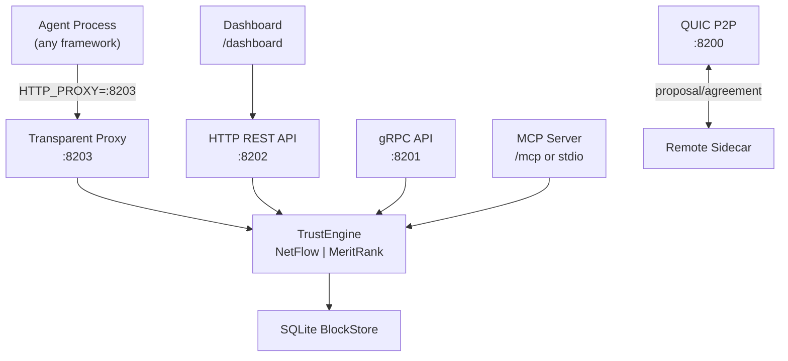

# TrustChain

[](https://github.com/viftode4/trustchain/actions)
[](LICENSE)

**Decentralized trust infrastructure for the AI agent economy.**

AI agents can now pay each other directly — Stripe, Coinbase, Visa, Mastercard all have live agent payment rails. There's no way to know if the agent you're paying is legitimate. No reputation, no history, nothing.

TrustChain is the missing layer. Every agent-to-agent interaction produces a bilateral cryptographic record signed by both parties. Trust scores emerge from real interaction history — fake identities can't manufacture a transaction graph, and an agent that scams once carries that record forever.

Built on the [TrustChain protocol](https://doi.org/10.1016/j.future.2017.08.048) (Otte, de Vos, Pouwelse — TU Delft), extended with pluggable trust computation (NetFlow max-flow + MeritRank random walks) and an [IETF Internet-Draft](https://datatracker.ietf.org/doc/draft-viftode-trustchain-trust/) for agent economies.

## Quick Start

### For Python agents (easiest)

```bash
pip install trustchain-py
```

```python
from trustchain import with_trust

@with_trust(name="my-agent")
def main():
    # All HTTP calls are now trust-protected. Binary downloads automatically.
    ...

main()
```

### Install the binary directly

Download prebuilt binaries (Linux, macOS, Windows) from [GitHub Releases](https://github.com/viftode4/trustchain/releases).

### Run as a sidecar

```bash
# Generates identity, starts all services, prints HTTP_PROXY
trustchain-node sidecar --name my-agent --endpoint http://localhost:8080

# Then in your agent:
export HTTP_PROXY=http://127.0.0.1:8203
python my_agent.py   # all outbound HTTP calls are now trust-protected
```

### Launch wrapper (Dapr-style)

```bash
trustchain-node launch --name my-agent -- python my_agent.py
```

## Key Features

- **Transparent sidecar proxy** — agents set `HTTP_PROXY` once; trust is handled invisibly
- **Ed25519 identity** — self-sovereign keypairs, auto-generated on first run
- **Bilateral half-block chain** — each party signs only their own block; no coordinator
- **Single-player audit mode** — cryptographic audit log without a network; every tool call recorded as a self-signed audit block (agent black box recorder)
- **Pluggable Sybil resistance** — MeritRank random walks (default) or NetFlow max-flow; fake identities can't manufacture trust
- **QUIC P2P transport** — TLS 1.3 mutual auth, STUN NAT traversal
- **IPv8 UDP transport** — interoperable with py-ipv8/Tribler peers (feature-gated)
- **Live dashboard** — embedded HTML dashboard at `GET /dashboard`
- **Trust headers** — `X-TrustChain-Score`, `X-TrustChain-Pubkey`, `X-TrustChain-Interactions` injected into proxied responses
- **SQLite storage** — WAL mode, survives restarts
- **Delegation protocol** — identity succession and capability delegation with revocation
- **MCP server** — expose trust tools to Claude Desktop, Cursor, VS Code Copilot
- **Audit blocks** — `BlockType::Audit` for unilateral events; self-referencing, no counterparty needed
- **304 tests** across the workspace

## Architecture



### Crate Structure

| Crate | Description |
|-------|-------------|
| [`trustchain-core`](trustchain-core/) | Identity, half-blocks, block storage, trust engine, NetFlow, MeritRank, CHECO consensus, delegation |
| [`trustchain-transport`](trustchain-transport/) | QUIC P2P, gRPC, HTTP REST, transparent proxy, IPv8 UDP, dashboard, peer discovery, MCP server |
| [`trustchain-node`](trustchain-node/) | CLI binary — sidecar, launch wrapper, keygen, MCP stdio |
| [`trustchain-wasm`](trustchain-wasm/) | WASM bindings for browser/edge (experimental) |

## Default Ports

| Port | Protocol | Purpose |
|------|----------|---------|
| 8000 | UDP | IPv8 peer-to-peer (feature `ipv8`) |
| 8200 | QUIC/UDP | P2P transport |
| 8201 | gRPC/TCP | Protobuf API |
| 8202 | HTTP/TCP | REST API + dashboard + MCP |
| 8203 | HTTP/TCP | Transparent proxy |

All ports shift with `--port-base`.

## HTTP API

| Method | Path | Description |
|--------|------|-------------|
| `GET` | `/healthz` | Liveness probe |
| `GET` | `/status` | Node status: pubkey, chain length, peer count |
| `GET` | `/dashboard` | Live trust dashboard (embedded HTML) |
| `GET` | `/metrics` | Prometheus metrics |
| `GET` | `/trust/{pubkey}` | Trust score (0.0–1.0) |
| `POST` | `/propose` | Initiate bilateral interaction |
| `GET` | `/peers` | List known peers |
| `GET` | `/discover` | Discover peers by capability |
| `POST` | `/delegate` | Create delegation |
| `POST` | `/revoke` | Revoke delegation |
| `GET` | `/chain/{pubkey}` | Full chain for a peer |
| `GET` | `/block/{pubkey}/{seq}` | Single block by sequence |
| `GET` | `/crawl/{pubkey}` | Crawl peer's chain |
| `GET` | `/delegations/{pubkey}` | List delegations |
| `GET` | `/identity/{pubkey}` | Resolve identity |
| `POST` | `/accept_delegation` | Accept inbound delegation |
| `POST` | `/accept_succession` | Accept identity succession |

## Trust Scoring

**Trust = connectivity × integrity × diversity × recency** (4-factor multiplicative model, v3)

| Factor | Formula | What it measures |
|--------|---------|-----------------|
| **Connectivity** | min(path_diversity / 3.0, 1.0) | Sybil resistance — independent paths from seed nodes |
| **Integrity** | valid_blocks / total_blocks | Hash links, sequence continuity, Ed25519 signatures |
| **Diversity** | min(unique_peers / 5.0, 1.0) | Distinct interaction partners |
| **Recency** | exponential decay (λ=0.95) | Recent interactions dominate; last ~20 interactions carry most weight |

Two pluggable algorithms for the connectivity factor:

| Algorithm | Type | Feature flag |
|-----------|------|-------------|
| **MeritRank** (default) | Personalized random walks with bounded Sybil resistance | `meritrank` (in default features) |
| **NetFlow** | Max-flow (Edmonds-Karp) from seed super-source | always available |

Proven fraud → permanent hard-zero trust score. No seeds configured → integrity × recency only.

## Trust Engine Architecture

TrustChain's trust computation is implemented as a 7-layer engine across 8 modular Rust crates in `trustchain-core/src/`:

| Layer | Module | What it does |
|-------|--------|-------------|
| L1 | `trust.rs` | Quality signals — transaction quality scores, value-weighted recency, timeout tracking |
| L2 | `trust.rs` | Statistical confidence — Wilson score lower bound, Beta reputation (Bayesian updating) |
| L3 | `tiers.rs`, `thresholds.rs` | Trust tiers — progressive capability unlocking, Josang threshold enforcement |
| L4 | `sanctions.rs`, `correlation.rs`, `forgiveness.rs` | Sanctions & recovery — graduated penalties, correlated-delegate penalty, forgiveness |
| L5 | `behavioral.rs`, `collusion.rs` | Behavioral detection — change detection, selective scamming, collusion ring identification |
| L6 | `trust.rs` | Requester reputation — payment reliability, rating fairness, dispute rate |
| L7 | `protocol.rs` | Delegation quotas — MAX_ACTIVE_DELEGATIONS=10, scope escalation prevention |

All 7 layers feed into the `TrustEvidence` struct (32 fields) returned by `compute_trust()` and `compute_requester_trust()`.

**Research basis:** Josang & Ismail 2002 (Beta reputation), Evan Miller 2009 (Wilson score confidence), Xiong & Liu 2004 (PeerTrust requester reputation), Hooi et al. 2016 (collusion detection).

## Protocol

Based on [IETF draft-pouwelse-trustchain](https://datatracker.ietf.org/doc/draft-pouwelse-trustchain/):

```
Alice's chain:              Bob's chain:
┌──────────────┐            ┌──────────────┐
│ PROPOSAL     │──────────► │ AGREEMENT    │
│ seq=2, sig=A │ ◄───────── │ seq=2, sig=B │
└──────────────┘            └──────────────┘
       ▲                           ▲
┌──────────────┐            ┌──────────────┐
│ PROPOSAL     │──────────► │ AGREEMENT    │
│ seq=1, sig=A │ ◄───────── │ seq=1, sig=B │
└──────────────┘            └──────────────┘
```

## Building from Source

```bash
git clone https://github.com/viftode4/trustchain.git
cd trustchain
cargo build --release
cargo test --workspace                         # 304 tests
cargo test --workspace --features meritrank    # include MeritRank tests
cargo test --workspace --features ipv8         # include IPv8 transport tests
```

## Research

**Core paper**: Otte, de Vos, Pouwelse — [TrustChain: A Sybil-resistant scalable blockchain](https://doi.org/10.1016/j.future.2017.08.048) (Future Generation Computer Systems, 2020)

**Trust algorithms**:
- Nasrulin, Ishmaev, Pouwelse — [MeritRank: Sybil Tolerant Reputation for Merit-based Tokenomics](https://arxiv.org/abs/2207.09950) (2022)
- Werthenbach, Pouwelse — [Social Reputation Mechanisms](https://arxiv.org/abs/2212.06436) (2022)

**IETF drafts**:
- [draft-pouwelse-trustchain-01](https://datatracker.ietf.org/doc/draft-pouwelse-trustchain/) — base bilateral ledger protocol (Pouwelse, TU Delft, 2018)
- [draft-viftode-trustchain-trust-00](https://datatracker.ietf.org/doc/draft-viftode-trustchain-trust/) — trust computation, NetFlow Sybil resistance, delegation, succession (filed March 2026)

## Public Seed Node

A public seed node is running at `http://5.161.255.238:8202` (pubkey: `2ab9b393...`). It is the default bootstrap peer in all SDKs — new agents connect automatically without any configuration.

## Related Projects

- [trustchain-py](https://github.com/viftode4/trustchain-py) — Python SDK: `pip install trustchain-py`, `@with_trust` decorator
- [trustchain-js](https://github.com/viftode4/trustchain-js) — TypeScript SDK: `npm install @trustchain/sdk`
- [trustchain-agent-os](https://github.com/viftode4/trustchain-agent-os) — Agent framework adapters (12 frameworks)

## License

Apache-2.0
